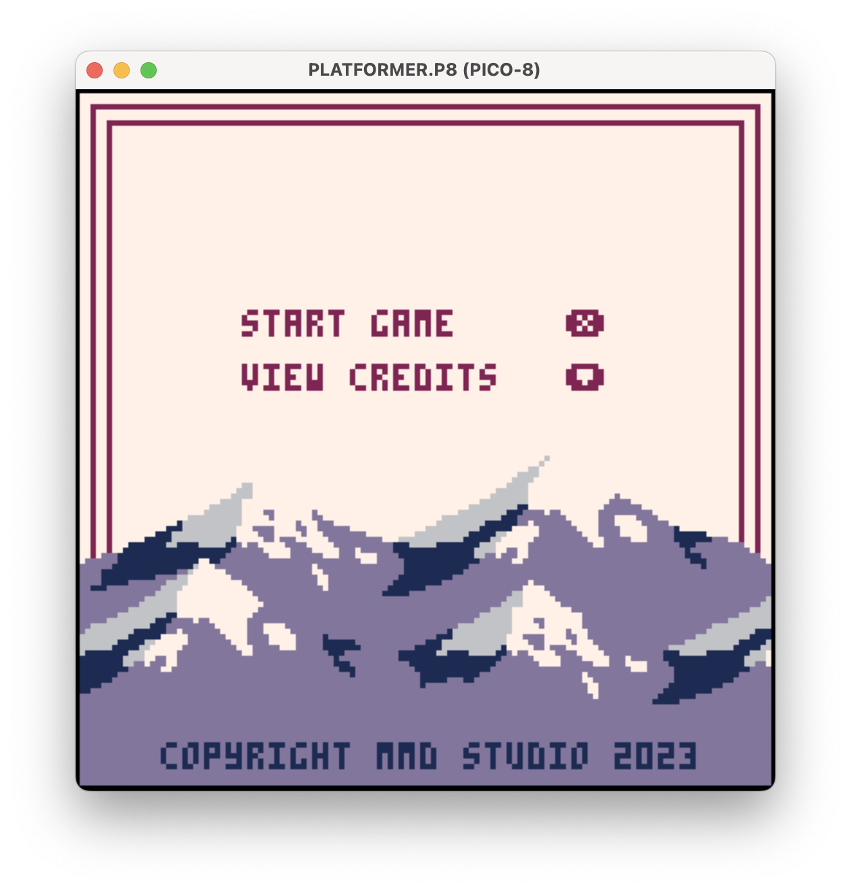
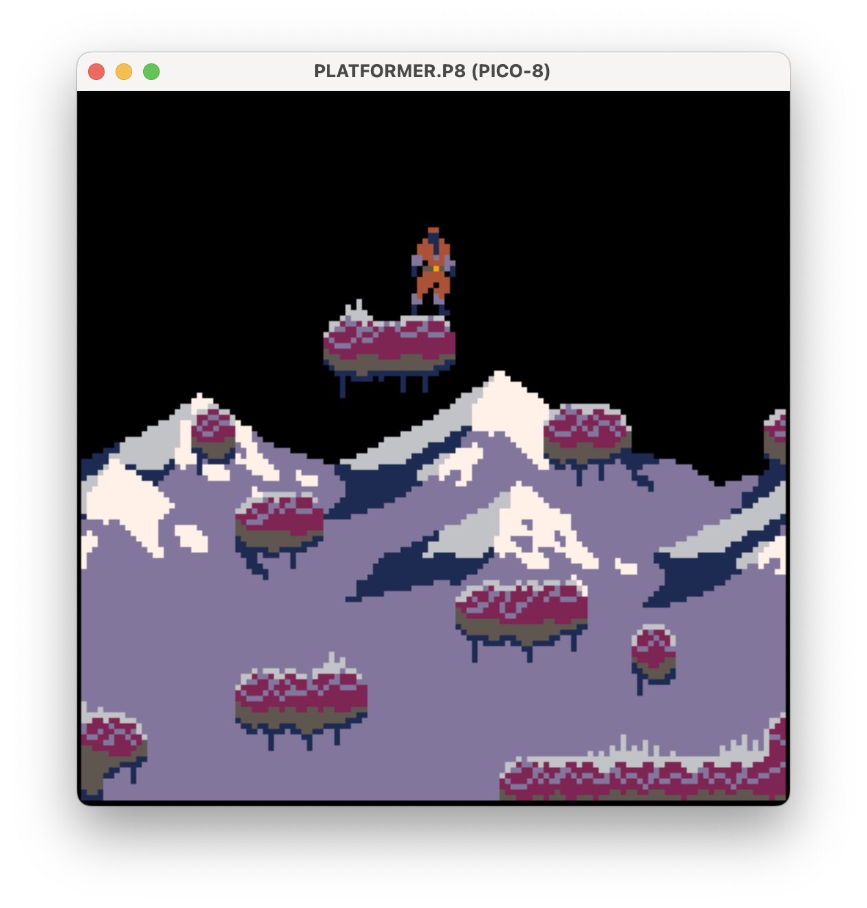

# Projet Collectif - Pico-8
School project

23/10/2023 -> 02/11/2024

## Project overview
This was my first group project since I started to learn to code. We discovered Lua and the Pico-8 game engine. We could create whatever kind of game we wanted. As this was our first project, we always worked together in a mob programming setup. I worked a lot on the creative direction of the game, which involved designing the character sprite, crafting the background and terrain, and developing UI elements.

## Tech stack and tools
- Affinity Designer
- Pico-8

## Teammates
- Mehdi Bejjar
- Daniela Ortúzar

## What I learned
I enjoyed delving into Lua and understanding fundamental game mechanics such as gravity, collisions, and game states. Additionally, I had a great time working on the artwork, despite the challenges posed by the limited color palette of the Pico-8 engine.

  

  

  

